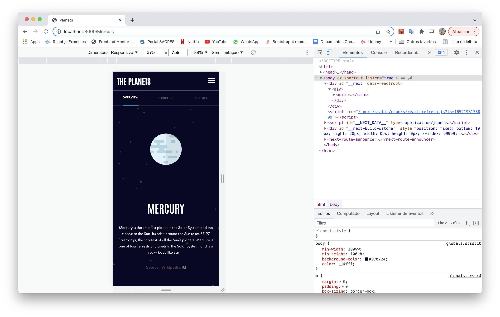
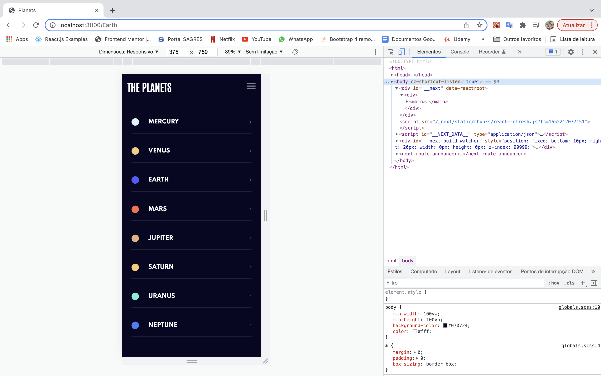
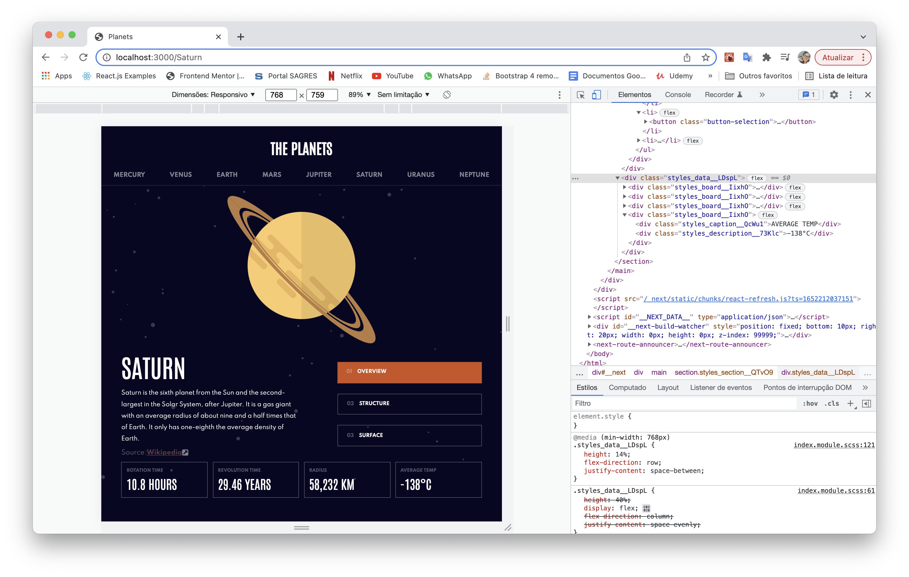
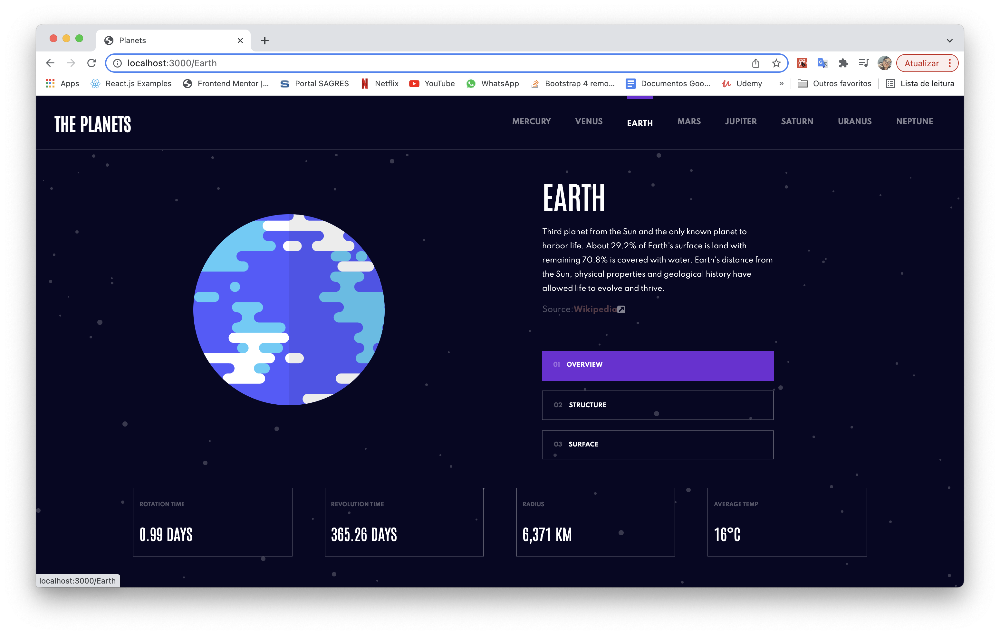
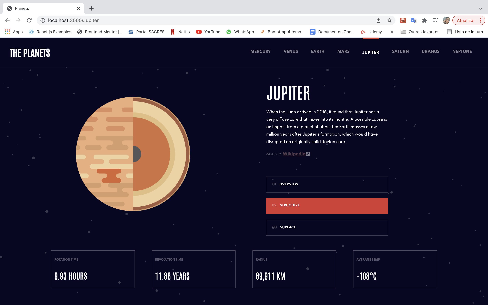
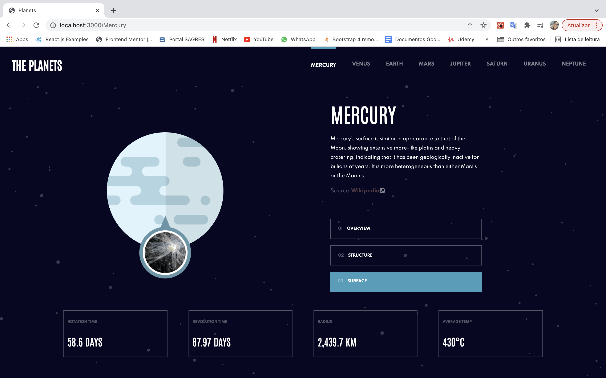

# Frontend Mentor - Planets fact site solution

This is a solution to the [Planets fact site challenge on Frontend Mentor](https://www.frontendmentor.io/solutions/planets-fact-site-HyeqXQjL9).

## Table of contents

- [Overview](#overview)
  - [The challenge](#the-challenge)
  - [Screenshot](#screenshot)
  - [Links](#links)
- [My process](#my-process)
  - [Built with](#built-with)
  - [What I learned](#what-i-learned)
  - [Continued development](#continued-development)
  - [Useful resources](#useful-resources)
- [Author](#author)

## Overview

### The challenge

Users should be able to:

- View the optimal layout for the app depending on their device's screen size
- See hover states for all interactive elements on the page
- View each planet page and toggle between "Overview", "Internal Structure", and "Surface Geology"

### Screenshot










### Links

- Solution URL: [Add solution URL here](https://github.com/ylanaportela/planet-fact-site)
- Live Site URL: [Add live site URL here](https://planet-fact-site-pearl.vercel.app/)

## My process

### Built with

- CSS module
- Mobile-first workflow
- [React](https://reactjs.org/) - JS library
- [Next.js](https://nextjs.org/) - React framework
- [Sass](https://sass-lang.com/) - For styles


### What I learned

In this challenge I could learn and implement in my project a new Hook of React.js, the useMemo, also practice the development with Next.js

```css
.image{
  height: 43%;
  display: flex;
  flex-direction: column;
  align-items: center;
  justify-content: center;

  .mercury{
    width: style.$width-planet;
  }

  .venus{
    width: calc(style.$width-planet + 43px);
  }

  .earth{
    width: calc(style.$width-planet + 62px);
  }
  
  .mars{
    width: calc(style.$width-planet + 18px);
  }
  
  .jupiter{
    width: calc(style.$width-planet + 113px);
  }
  
  .saturn{
    width: calc(style.$width-planet + 147px);
  }
  
  .uranus{
    width: calc(style.$width-planet + 65px);
  }
  
  .neptune{
    width: calc(style.$width-planet + 62px);
  }
}
```
```js
 const [ state, setState ] = useState('overview')

  const currentPlanet = useMemo(() => {
    return Datas.find(data => data.name === planet)
  }, [planet])

  const attribute = useMemo(()=>{
    return currentPlanet[state]
  }, [currentPlanet, state])
```

### Continued development

I want continue developing my abilities in React.js and learn more about Next.js.

### Useful resources

- [Article](https://medium.com/reactbrasil/react-usememo-na-pr%C3%A1tica-692110771c01) - This helped me understand the hook useMemo. I really liked this pattern and will use it going forward.
- [Article](https://css-tricks.com/css-modules-part-1-need/) - This is an amazing article which helped me finally understand CSS Modules. I'd recommend it to anyone still learning this concept.
## Author

 Linkedin - [Ylana Portela](https://www.linkedin.com/in/ylana-portela/)
- Frontend Mentor - [@ylanaportela](https://www.frontendmentor.io/profile/ylanaportela)
